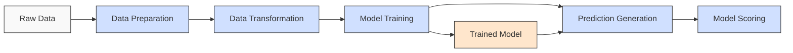

# Migrating Machine Learning Pipelines 
# from Amazon SageMaker to Azure Machine Learning

## Presentation Overview

---

## Agenda

1. Understanding the Migration Journey
2. Amazon SageMaker vs. Azure ML: Key Differences
3. Azure ML Components & Pipeline Architecture
4. Implementation Approaches: SDK vs CLI
5. Migration Strategy & Best Practices
6. Demo: NYC Taxi Regression Pipeline
7. Deployment & Operationalization
8. Performance Monitoring & Optimization
9. Resources & Next Steps

---

## 1. Understanding the Migration Journey

### Why Migrate from SageMaker to Azure ML?

- **Integration with Azure Ecosystem**: Better integration with other Azure services
- **Cost Optimization**: Flexible compute options and consumption-based pricing
- **Enterprise Security Features**: Microsoft Entra ID integration, RBAC, private endpoints
- **MLOps Capabilities**: Comprehensive approach to ML lifecycle management
- **Component Reusability**: Modular pipeline components with registered versioning

### Migration Process Overview

1. **Assessment**: Analyze existing SageMaker workloads
2. **Design**: Map to Azure ML architecture
3. **Implementation**: Rebuild pipelines in Azure ML
4. **Testing**: Validate performance and functionality
5. **Operationalization**: Deploy to production
6. **Optimization**: Continuous improvement

---

## 2. Amazon SageMaker vs. Azure ML: Key Differences

| Feature | Amazon SageMaker | Azure Machine Learning |
|---------|-----------------|------------------------|
| **Pipeline Definition** | SageMaker Pipeline SDK | YAML-based components & Python SDK |
| **Component System** | Processing jobs, training jobs | Reusable components with YAML definitions |
| **Compute Management** | SageMaker instances | Compute clusters, instance pools, serverless |
| **Experiment Tracking** | SageMaker experiments | Azure ML datasets, Jobs & MLflow integration |
| **Model Registry** | SageMaker Model Registry | Azure ML Model Registry with versioning |
| **Deployment Options** | Endpoints, batch transform | Real-time endpoints, batch endpoints, online endpoints |
| **Security** | IAM roles | Microsoft Entra ID, RBAC |
| **Monitoring** | CloudWatch | Azure Monitor, Application Insights |

---

## 3. Azure ML Components & Pipeline Architecture

### Key Concepts

- **Workspace**: Central place to work with all your ML artifacts
- **Datastore**: Connection to storage services
- **Dataset**: Reference to data in a datastore
- **Environment**: Docker containers with dependencies
- **Component**: Reusable pipeline step (similar to SageMaker Processing steps)
- **Pipeline**: Workflow connecting components
- **Job**: Execution instance of a pipeline or component

### NYC Taxi Regression Pipeline Example



*Pipeline Architecture: Data preparation → Data transformation → Model training → Prediction generation → Model scoring*

---

## 4. Implementation Approaches: SDK vs CLI

### Python SDK Approach

```python
@pipeline()
def nyc_taxi_data_regression(pipeline_job_input):
    # Component 1: Data preparation
    prepare_sample_data = components["prepare_data"](raw_data=pipeline_job_input)
    
    # Component 2: Data transformation
    transform_sample_data = components["transform_data"](
        clean_data=prepare_sample_data.outputs.prep_data
    )
    
    # Component 3: Model training
    train_with_sample_data = components["train_model"](
        training_data=transform_sample_data.outputs.transformed_data
    )
    
    # More components...
```

### CLI Approach (YAML)

```yaml
$schema: https://azuremlschemas.azureedge.net/latest/pipelineJob.schema.json
type: pipeline
display_name: nyc_taxi_data_regression
jobs:
  prep_job:
    type: command
    component: ./prep.yml
    inputs:
      raw_data:
        type: uri_folder
        path: ./data
    outputs:
      prep_data: 
  transform_job:
    type: command
    component: ./transform.yml
    inputs:
      clean_data: ${{parent.jobs.prep_job.outputs.prep_data}}
```

### SageMaker to Azure ML Mapping

| SageMaker | Azure ML | Notes |
|-----------|----------|-------|
| `estimator = Estimator(...)` | Component YAML + Python script | Define compute, environment, and code |
| `step = ProcessingStep(...)` | Component YAML definition | Define inputs, outputs, and parameters |
| `pipeline = Pipeline(steps=[...])` | `@pipeline()` decorator or pipeline.yml | Define workflow |
| `pipeline.start()` | `ml_client.jobs.create_or_update()` | Submit pipeline for execution |

---

## 5. Migration Strategy & Best Practices

### Step-by-Step Migration

1. **Map SageMaker processing steps** to Azure ML components
2. **Convert SageMaker built-in containers** to Azure ML environments
3. **Transform data connections** from S3 to Azure Storage
4. **Adapt IAM roles** to Microsoft Entra ID authentication
5. **Migrate metrics tracking** from CloudWatch to Azure Monitor

### Best Practices for Azure ML

- **Use Managed Identities**: Secure authentication without hardcoded credentials
- **Component Versioning**: Register components with versions for reproducibility
- **Optimize Compute**: Choose appropriate compute SKUs for each task
- **Data Access**: Use datastores and datasets for efficient data handling
- **Environment Management**: Use Docker containers for consistent environments
- **Monitoring**: Implement comprehensive logging and monitoring

---

## 6. Demo: NYC Taxi Regression Pipeline

### Component Structure

```
component/
├── src/                  # Source code
│   └── script.py         # Script that executes component logic
├── environment/          # Optional Docker environment
│   └── Dockerfile        # Custom environment definition
└── component.yml         # Component definition
```

### Component Definition (YAML)

```yaml
$schema: https://azuremlschemas.azureedge.net/latest/commandComponent.schema.json
name: train_linear_regression_model
version: 1
type: command
inputs:
  training_data: 
    type: uri_folder
outputs:
  model_output:
    type: mlflow_model
environment: azureml://registries/azureml/environments/sklearn-1.5/latest
code: ./train_src
command: >-
  python train.py 
  --training_data ${{inputs.training_data}} 
  --model_output ${{outputs.model_output}}
```

---

## 7. Deployment & Operationalization

### From Development to Production

1. **Register Pipeline**: Save production-ready pipeline
2. **Schedule Runs**: Set up trigger-based or scheduled executions
3. **Configure CI/CD**: Integrate with Azure DevOps or GitHub Actions
4. **Deploy Models**: Set up online or batch endpoints

### Model Deployment Methods

| SageMaker | Azure ML | 
|-----------|----------|
| SageMaker Endpoints | Azure ML Online Endpoints |
| Batch Transform Jobs | Azure ML Batch Endpoints |
| SageMaker Serverless | Azure Container Instances |
| Model Monitor | Azure ML Data Drift monitoring |

---

## 8. Performance Monitoring & Optimization

### Monitoring Machine Learning Systems

- **Training Jobs**: Track resource usage, execution time
- **Deployed Models**: Monitor latency, throughput, errors
- **Data Drift**: Compare training and inference data distributions
- **Resource Optimization**: Right-size compute resources

### Key Metrics

- **Model Performance**: Accuracy, precision, recall, F1-score
- **System Performance**: Response time, throughput, utilization
- **Cost Efficiency**: Compute hours, data transfer

---

## 9. Resources & Next Steps

### Additional Resources

- [Azure ML Documentation](https://learn.microsoft.com/azure/machine-learning/)
- [Component & Pipeline Examples](https://github.com/Azure/azureml-examples)
- [Migration Guide: SageMaker to Azure ML](https://learn.microsoft.com/azure/architecture/reference-architectures/ai-machine-learning/mlops-technical-paper)
- [MLOps Best Practices](https://learn.microsoft.com/azure/architecture/example-scenario/mlops/mlops-technical-paper)

### Next Steps

1. **Hands-on Lab**: Complete the NYC Taxi Regression tutorial
2. **Workspace Setup**: Configure your Azure ML workspace
3. **Test Migration**: Migrate a single SageMaker pipeline
4. **MLOps Implementation**: Set up CI/CD for your pipelines

---

## Thank You!

Questions? Contact your Azure ML specialist.
