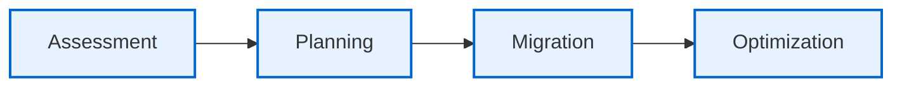
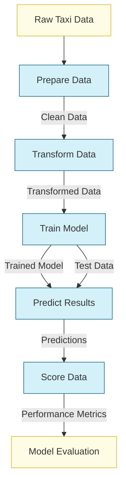
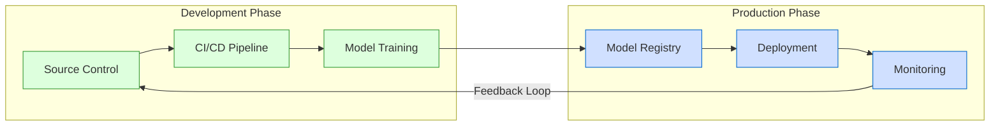

# Migrating ML Pipelines from Amazon SageMaker to Azure Machine Learning

## Technical Onboarding Workshop

---

# Agenda

- **Introduction & Migration Overview** (15min)
- **Architecture Comparison** (20min)
- **Hands-on: NYC Taxi Regression Pipeline** (90min)
- **Break** (15min)
- **Best Practices & Production Considerations** (30min)
- **Cost Optimization & Monitoring** (20min)
- **Q&A and Next Steps** (20min)

---

# Introduction

## Why Migrate to Azure Machine Learning?

- **Unified ML Platform**: Comprehensive toolset across the ML lifecycle
- **Enterprise Grade**: Security, governance, and compliance capabilities
- **Integration**: Seamlessly connect with other Azure services
- **Advanced MLOps**: Built-in CI/CD and versioning
- **Cost Optimization**: Pay-as-you-go pricing and flexible compute options

---

# Migration Journey Overview



*Migration Journey: Assessment → Planning → Migration → Optimization*

---

# Architecture Comparison

| SageMaker | Azure ML | What's Different |
|-----------|----------|-----------------|
| SageMaker Studio | Azure ML Studio | More integrated workspace experience |
| Processing Jobs | Command Components | More flexible component definition |
| Training Jobs | Command Components | Better versioning and reusability |
| SageMaker Pipelines | Azure ML Pipelines | YAML-based definition and SDK options |
| Model Registry | Model Registry | Built-in MLflow integration |
| SageMaker Endpoints | Online/Batch Endpoints | More deployment options |

---

# Authentication & Access Control

**SageMaker**
```python
import boto3
import sagemaker
role = sagemaker.get_execution_role()
```

**Azure ML**
```python
from azure.identity import DefaultAzureCredential
from azure.ai.ml import MLClient
credential = DefaultAzureCredential()
ml_client = MLClient.from_config(credential=credential)
```

### Key Differences
- AWS IAM Roles → Microsoft Entra ID (Azure AD)
- AWS Secret Manager → Azure Key Vault
- SageMaker Execution Roles → Managed Identities

---

# Data Storage & Access

**SageMaker**
```python
s3_input = sagemaker.inputs.TrainingInput(
    s3_data="s3://bucket/data",
    content_type="csv"
)
```

**Azure ML**
```python
from azure.ai.ml import Input
input_data = Input(
    type="uri_folder",
    path="azureml://datastores/workspaceblobstore/paths/data"
)
```

### Key Differences
- Amazon S3 → Azure Blob Storage / Data Lake Storage
- Different URI formats and access patterns

---

# NYC Taxi Regression Example
## Pipeline Architecture



*NYC Taxi Pipeline: The pipeline processes taxi data through preparation, transformation, training, prediction and scoring steps to create a fare prediction model*

---

# Hands-on Lab - Part 1
## Setting Up Azure ML Workspace

1. **Login to Azure Portal**
   - Navigate to Azure Machine Learning
   - Create a new workspace

2. **Setup Compute Resources**
   - Create compute cluster
   - Configure storage access
   - Define compute instance (for development)

3. **Install Azure ML SDK**
   ```bash
   pip install azure-ai-ml azure-identity
   ```

---

# Hands-on Lab - Part 2
## Components & Pipeline Creation

1. **Create Component Definitions**
```yaml
# train.yml
$schema: https://azuremlschemas.azureedge.net/latest/commandComponent.schema.json
name: train_linear_regression_model
version: 1
type: command
inputs:
  training_data: 
    type: uri_folder
outputs:
  model_output:
    type: mlflow_model
environment: azureml://registries/azureml/environments/sklearn-1.5/labels/latest
code: ./train_src
command: >-
  python train.py 
  --training_data ${{inputs.training_data}} 
  --model_output ${{outputs.model_output}}
```

---

# Hands-on Lab - Part 3
## Pipeline Creation - Python SDK

```python
@pipeline()
def nyc_taxi_data_regression(pipeline_job_input):
    # Step 1: Data preparation
    prepare_sample_data = components["prepare_data"](raw_data=pipeline_job_input)
    
    # Step 2: Data transformation
    transform_sample_data = components["transform_data"](
        clean_data=prepare_sample_data.outputs.prep_data
    )
    
    # Step 3: Model training
    train_with_sample_data = components["train_model"](
        training_data=transform_sample_data.outputs.transformed_data
    )
    
    # Additional steps...
```

---

# Hands-on Lab - Part 4
## Pipeline Creation - YAML (CLI)

```yaml
$schema: https://azuremlschemas.azureedge.net/latest/pipelineJob.schema.json
type: pipeline
display_name: nyc_taxi_data_regression
jobs:
  prep_job:
    type: command
    component: ./prep.yml
    inputs:
      raw_data:
        type: uri_folder
        path: ./data
    outputs:
      prep_data: 
  transform_job:
    type: command
    component: ./transform.yml
    inputs:
      clean_data: ${{parent.jobs.prep_job.outputs.prep_data}}
```

---

# Hands-on Lab - Part 5
## Running the Pipeline

**Python SDK**
```python
# Configure and submit pipeline job
pipeline_job = configure_pipeline_job(
    nyc_taxi_data_regression, 
    input_path=data_path
)

submit_pipeline_job(
    ml_client=ml_client,
    pipeline_job=pipeline_job, 
    experiment_name="pipeline_samples"
)
```

**CLI**
```bash
az ml job create --file pipeline.yml
```

---

# Best Practices for Azure ML

## Component Design
- **Modular design**: Single responsibility principle
- **Explicit inputs/outputs**: Clear I/O contracts
- **Version components**: Track changes
- **Reusable logic**: Abstract common patterns

## Environment Management
- **Use curated environments** when possible
- **Version custom environments**
- **Minimize Docker image size**
- **Document dependencies**

---

# MLOps in Azure ML



*MLOps workflow in Azure: Source control → CI/CD Pipeline → Model Training → Model Registry → Deployment → Monitoring*

---

# Production Considerations

## Security
- **Authentication**: Use Microsoft Entra ID and Managed Identities
- **Network Security**: Private endpoints and VNet integration
- **Data Encryption**: Configure customer-managed keys

## Monitoring
- **Model Monitoring**: Set up data drift detection
- **Application Insights**: Track endpoint performance
- **Log Analytics**: Centralize logging

## Scaling
- **Autoscaling**: Configure appropriate min/max node counts
- **Instance Selection**: Right-size compute for workloads
- **Batch Processing**: Use batch endpoints for high-volume scenarios

---

# Cost Optimization

## Cost-saving Strategies
- **Autoscale to zero** when not in use
- **Use Azure Spot VMs** for non-critical workloads
- **Right-size compute** based on workload requirements
- **Use low-priority VMs** for development
- **Schedule automatic shutdowns**

```python
# Create compute with autoscaling
compute_cluster = AmlCompute(
    name="cpu-cluster",
    min_instances=0,
    max_instances=4,
    idle_time_before_scale_down=1800  # 30 minutes
)
```

---

# Migration Checklist

- [ ] **Map SageMaker resources** to Azure ML resources
- [ ] **Set up Azure ML workspace** and compute resources
- [ ] **Migrate data** from S3 to Azure Storage
- [ ] **Convert SageMaker processing steps** to Azure ML components
- [ ] **Build and test** Azure ML pipelines
- [ ] **Set up model deployment** infrastructure
- [ ] **Configure monitoring and alerting**
- [ ] **Establish CI/CD pipelines** for MLOps
- [ ] **Document and train** the team on the new platform

---

# Key Takeaways

1. **Component-based Design**: Azure ML components provide a modular, reusable approach to ML workflows
2. **Multiple Interface Options**: Choose between SDK and CLI/YAML approaches
3. **Enterprise Integration**: Better security and governance with Azure ecosystem
4. **Advanced MLOps**: Built-in versioning, monitoring, and deployment options
5. **Cost-effective**: Various optimization strategies to reduce costs

---

# Resources

- [Azure Machine Learning Documentation](https://learn.microsoft.com/azure/machine-learning/)
- [Azure ML Examples Repository](https://github.com/Azure/azureml-examples)
- [ML Pipelines in Azure ML](https://learn.microsoft.com/azure/machine-learning/how-to-create-component-pipelines-cli)
- [Component YAML Schema](https://learn.microsoft.com/azure/machine-learning/reference-yaml-component)
- [Migration Guide](https://learn.microsoft.com/azure/architecture/reference-architectures/ai-machine-learning/mlops-python)

---

# Q&A

Thank You!
